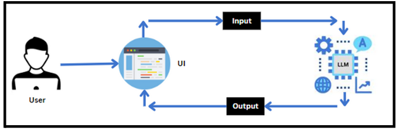

# ATS-optimized-resume-analyzer-using-gemini-model

Overview
CareerCraft is a cutting-edge application designed to revolutionize the job application process using advanced ATS (Applicant Tracking System) technology. This innovative system empowers job seekers by providing valuable insights into their resumes' compatibility with job descriptions, identifying missing keywords, and offering tailored profile summaries. CareerCraft helps users optimize their resumes for better presentation to potential employers, thus enhancing their chances in a competitive job market.

Features
ATS Compatibility Scoring: Analyzes resumes against job descriptions and provides a percentage match score.
Missing Keywords Identification: Highlights missing keywords crucial to the job description to enhance resume optimization.
Profile Summary Generation: Creates tailored profile summaries to enhance resume presentation.
Skill Enhancement and Career Progression Guidance: Offers personalized recommendations to improve skills and career trajectory.

  

Contact
For any questions, issues, or feedback, please reach out:

Piyush Kashyap - piyushkashyap3247@gmail.com