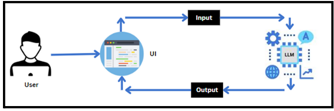

# 🎯 CareerCraft – ATS Optimized Resume Analyzer using Gemini API

CareerCraft is a powerful, AI-driven Streamlit application that helps job seekers **analyze and optimize their resumes** based on specific job descriptions. It leverages **Google Gemini (Generative AI)** to provide real-time feedback on resume compatibility, missing keywords, profile summary generation, and career recommendations.

## 🚀 Key Features
- 🔍 **ATS Compatibility Scoring
Get a percentage match score between your resume and job description using NLP and AI analysis.

- 🧠 **Missing Keyword Detection**
Instantly identify skills, qualifications, and action words that your resume lacks based on the job description.

- ✨ **AI-Generated Profile Summary**
Create a customized, job-specific profile summary to enhance your resume’s appeal to recruiters and ATS systems.

- 📈 **Career Guidance & Skill Suggestions**
Receive targeted recommendations to improve your skillset and align your resume with current industry demands.

## 🧠 Tech Stack
- **Frontend/UI**: Streamlit

- **Backend**: Python (Google Gemini API)

- **AI/LLM**: Gemini Pro via Google Cloud

- **Document Parsing**: PDF and text extraction for resume content

## 🖥️ Demo
| 🔗 Live App: [Click here to try CareerCraft](https://ats-optimized-resume-analyzer-using-gemini-model-n8trixwjhi4eb.streamlit.app/) |

## 📂 Input Instructions
This app requires two inputs:

- 📄 **Resume**: Upload your resume in PDF format.

- 📝 **Job Description (JD)**: Paste the job description text into the input box.

CareerCraft will process both and return:

- Match Score

- Missing Keywords

- AI-written Profile Summary

- Personalized Career Tips

  

## ⚙️ Deployment Guide
- 🔗 Dependencies
Install all required packages with:
pip install -r requirements.txt
- 🔐 Environment Variables
Create a .env file in the project root with:

## dotenv Sample
- EMAIL_ADDRESS=your-email@example.com
- EMAIL_PASSWORD=your-email-password
- GOOGLE_API_KEY=your-google-api-key
- These are used to send feedback/results and access Google Gemini API securely.

## 🖥️ Screenshots

## ▶️ Run Locally
- streamlit run app.py
- The application will launch in your browser at http://localhost:8501.

## 📬 Contact
If you have any questions, feedback, or need help using the application:

Piyush Kashyap
📧 piyushkashyap3247@gmail.com
🔗 [LinkedIn](https://www.linkedin.com/in/piyush-kashyap731/)
